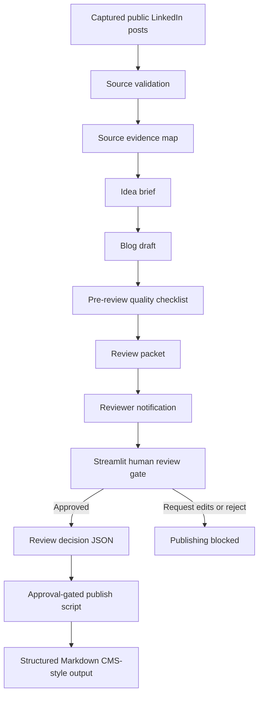

# Terret Agentic Content Workflow

This is my take-home project for Terret’s Agentic Workflow Intern interview. I built a local prototype of the content workflow in the brief: public LinkedIn signal in, Terret-style blog draft out, with human review required before anything can be published.

I prioritized building one complete vertical slice rather than connecting every production integration at once. The workflow starts with captured Justin Shriber posts, creates draft and review materials, notifies a reviewer, saves the review decision from the Streamlit app, and writes the final Markdown post only after it is approved.

## At a Glance

Built and working locally:

* Source post validation
* Source evidence map with source URLs, excerpts, theme flags, and reviewer trace notes
* Idea brief and blog draft artifacts
* Pre-review quality checklist
* Reviewer notification artifact
* Streamlit approve / request-edits / reject gate
* Saved review decision JSON
* Publish script that blocks unless approval exists
* Structured Markdown output with title, slug, meta description, tags, author, source post IDs, and body

Scoped down for the demo:

* LinkedIn ingestion is manual public capture, not scraping or API ingestion
* Draft generation is deterministic, using a representative draft based on five captured Justin Shriber posts and Terret positioning
* Notification writes a local Markdown artifact unless a webhook URL is configured
* Publishing writes to a CMS-style Markdown folder, not a live CMS
* Reviewer identity is typed in the local app, not authenticated

## Workflow

```text
source posts
→ source evidence map
→ idea brief
→ blog draft
→ pre-review quality checklist
→ review packet
→ reviewer notification
→ human review app
→ review decision JSON
→ approval-gated publish script
→ static-site-style Markdown output
```

## Architecture



I think of the workflow in four layers:

* **Monitoring / source layer:** captured LinkedIn posts, source validation, and source evidence mapping
* **Synthesis layer:** idea brief, representative draft, and quality checklist
* **Human control layer:** reviewer notification, review packet, Streamlit decision app, and saved approval state
* **Activation layer:** publish script that only writes the public Markdown post after approval


Live example:

```text
Why CROs Need More Than an LLM on Top of Their Revenue Data
```
My main goal was to show how the control layer works in a content workflow.

The prototype collects the source signal, prepares reviewer-facing materials, sends notifications, tracks approvals, and stops publishing if approval is missing. The draft moves through the system as a content artifact, but it cannot be published on its own.

## Quick Demo

From the repo root:

```powershell
python -m pip install -r requirements.txt
python src/run_workflow.py
python -m streamlit run src/review_app.py
python src/publish.py
```

Expected generated files:

```text
outputs/idea_briefs/idea_brief_001.md
outputs/drafts/blog_draft_001.md
outputs/quality_checks/quality_check_001.md
outputs/review_packets/review_packet_001.md
outputs/notifications/notification_001.md
outputs/source_maps/source_evidence_map_001.md
outputs/source_maps/source_evidence_map_001.json
outputs/review_decisions/review_decision_001.json
outputs/published/blog_post_001.md
site/posts/why-cros-need-more-than-an-llm-on-revenue-data.md
```

To confirm internal review notes were removed from the public post:

```powershell
Select-String -Path site\posts\why-cros-need-more-than-an-llm-on-revenue-data.md -Pattern "Review Notes"
```

A clean result prints nothing.

## Full Run Order

Start by generating the idea brief, draft, quality check, review packet, and notification.

```powershell
python src/run_workflow.py
```

Next, open the reviewer app.

```powershell
python -m streamlit run src/review_app.py
```

Inside the app, review the draft and choose one option: approve, request edits, or reject.

Then run:

```powershell
python src/publish.py
```

If approval is missing, rejected, or marked as request-edits, publishing will not proceed. Once approval is given, the script generates the final Markdown post.

The system does not treat generation as the finish line. Before becoming public, the draft has to pass through a quality checklist, reviewer notification, human review, saved approval state, and final publish check.

## Notification

The notification step always creates this file:

```text
outputs/notifications/notification_001.md
```

This file gives the reviewer the draft title, source post IDs, draft path, review packet path, quality check path, source evidence map path, checklist, and next step.

Optional webhook delivery is configured in `.env.example`:

```text
NOTIFICATION_WEBHOOK_URL=
```

Leave this field blank for the local demo. If you set a value, `src/run_workflow.py` will send the notification through the webhook and also save the local artifact.

## Source Data and Context

Source posts are stored in:

```text
data/source_posts.json
```

The file contains five manually captured public LinkedIn posts from Justin Shriber. I chose posts around the same theme: revenue teams have plenty of tools and data, but still struggle to answer practical CRO questions like why forecast changed, why deals are slipping, and what should happen next.

The workflow also creates a source evidence map in:

```text
outputs/source_maps/source_evidence_map_001.md
outputs/source_maps/source_evidence_map_001.json
```

This map helps reviewers trace the captured source posts. For each post, it lists the source URL, capture date, capture method, representative excerpt, keyword-based theme flags, and reviewer trace note. This is not a live LLM citation system. Instead, it gives reviewers a simple way to inspect the connection between the source posts and the draft in this prototype. Reviewers can use it to check theme coverage, originality risk, and claim risk before approving publication.

Terret context is stored in:

```text
data/terret_context.md
```

That file gives the workflow shared context on Terret positioning, audience, editorial voice, product language, Revenue Graph concepts, content standards, and evidence boundaries.

## Prompt Files

The prompt blueprints are saved in:

```text
prompts/idea_brief_prompt.md
prompts/blog_generation_prompt.md
prompts/quality_check_prompt.md
```

These files show where a live LLM call would fit in a production version. The idea-brief prompt would act as the strategy layer, the blog-generation prompt would handle drafting, and the quality-check prompt would support pre-review checks.

## Human Review Gate

The review app is the human-facing control layer. The publish script is the enforcement layer.

A draft existing on disk is not enough to publish. `src/publish.py` reads the saved review decision first and only publishes when the decision is approved and `publish_allowed` is true.

Before creating the public post, the script checks the draft metadata and removes internal review notes.

I added `outputs/test_runs/blocked_publish_proof.md` and `outputs/test_runs/blocked_publish_output.txt` to show the negative path. If the approval state is rejected, request-edits, missing, or malformed, publishing fails safely.

## Design Choices

I narrowed the focus to make it easier to review one complete workflow.

I collected the LinkedIn posts manually since source ingestion was not the highest-risk part of the project. The bigger question was what happens after a public signal enters the system: how it turns into a draft, what information a reviewer needs, where approval fits in, and how to prevent publishing if approval is missing.

I kept the intermediate artifacts visible so each stage can be checked without reading the code. JSON stores structured state, such as source post metadata and review decisions. Markdown is used for artifacts a person needs to read, such as the draft, review packet, notification, and published post.

The publish step is the main safeguard. The system does not treat a generated draft as ready for release until a human has reviewed and approved it.

### Why the demo uses deterministic generation

For this version, I wanted the demo to behave the same way every time I ran it. The idea brief, draft, and quality check are generated with deterministic logic so the walkthrough is easier to inspect and less likely to fail because of one unpredictable model response.

I chose this approach because the main focus of the prototype is the workflow around the draft. It is important to keep the source context visible, give the reviewer enough information to decide, save the approval state, and prevent publication until approval is given.

For a production version, I would swap out the deterministic parts for live LLM calls. These would use the prompt files in `prompts/`, the captured source posts, and `data/terret_context.md`. I would still preserve the same safeguards: structured outputs, checks for required fields, retries for malformed responses, and human review for drafts that are uncertain or risky.

## What Still Breaks

This is a local prototype, not a complete product. It doesn’t connect to a live LLM API, verify reviewer identity, publish to a real CMS, or handle more than one batch of content. Webhook delivery depends on a `.env` setting and doesn’t support retries, delivery logs, or alerts yet.

Review state is saved in a local JSON file, so running the review app again can overwrite a previous decision. Source posts are added manually. The SEO, AEO, and GEO fields are included in the output, but they are not checked with an external SEO tool. The final result is a Markdown file in `site/posts/`, not a live website.

The main content risk is claims review. The sample draft comes from public founder posts and Terret positioning notes. Before publishing anything outside the team, a marketing reviewer should check product language, evidence boundaries, source similarity, and claim strength.

## Future Improvements

Next, I would:

* Turn the blocked-publish proof into an automated test
* Support multiple content batches
* Add reviewer authentication
* Add webhook retries and delivery logs
* Move file-based state into a clearer workflow/state-machine layer
* Replace the deterministic renderer with a live LLM call
* Publish to a deployed static site or real CMS

## Project Structure

```text
terret-content-workflow/
  data/
    source_posts.json
    terret_context.md
  prompts/
    idea_brief_prompt.md
    blog_generation_prompt.md
    quality_check_prompt.md
  src/
    run_workflow.py
    review_app.py
    publish.py
    send_notification.py
  outputs/
    source_maps/
    idea_briefs/
    drafts/
    quality_checks/
    review_packets/
    review_decisions/
    notifications/
    published/
    test_runs/
  site/
    posts/
  .env.example
  README.md
  requirements.txt
```
